# HN Comments
HN Comments is a browser extension to select and save comments from [Hackernews](https://news.ycombinator.com/).

## Why this extension?

Hackernews is one of my main source of news and information. The links and contents shared provide a good source of what happens in tech industry, science and society. In addition to shared links, the comments of the community (especially those of _Ask HN_) are also a valuable source of information and knowledge. I built this extension to select and save the comments I found interesting. 

## What I can do with this extension?

You can use _HN Comment_ for the following operations:
* Select a text and copy it to the extension's clipboard
* Extract all the comments containg links. Usually the best comments are those providing additional links or references
* Export the selected comments into one of the three formats: text, YAML or markdown
* Show the extension's clipboard
* Manage multiple Hackernews stories
* Edit the selected comment

## How to use the extension

1. Select a text and add it to the clipboard: just select a text and use _Add selection to HN clipboard_ in extension's contextual menu.
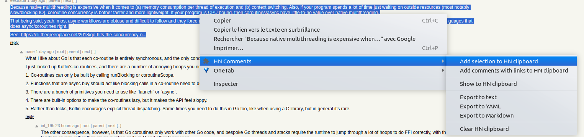

2. Extract all comments containg a link
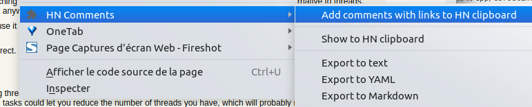

3. Export to text, Yaml or Markdown format
    * Text format
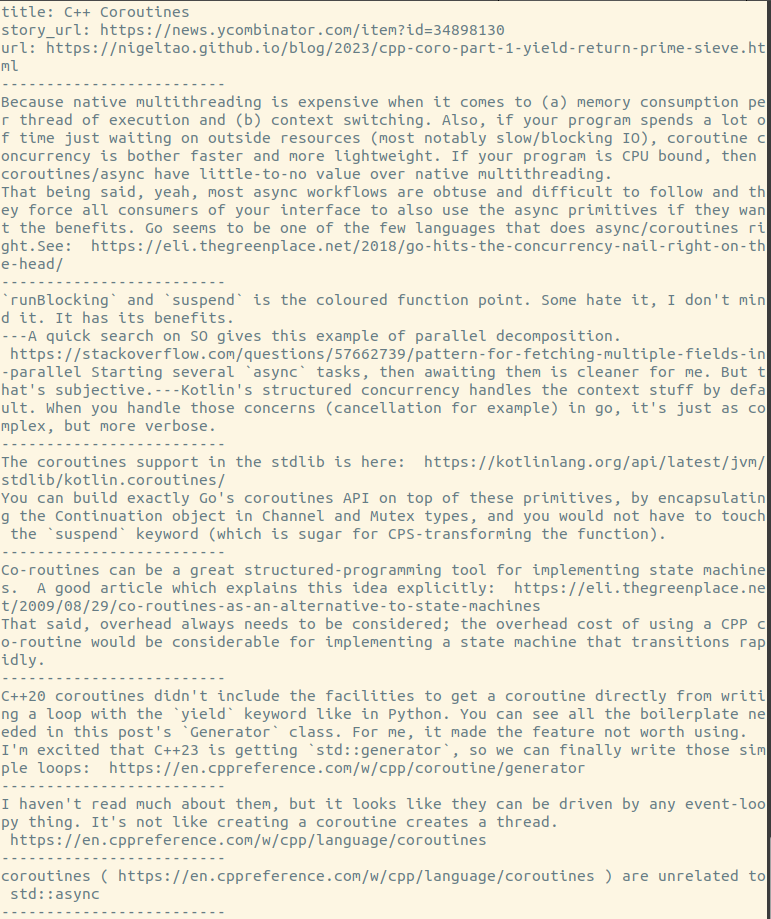
    * Yaml format
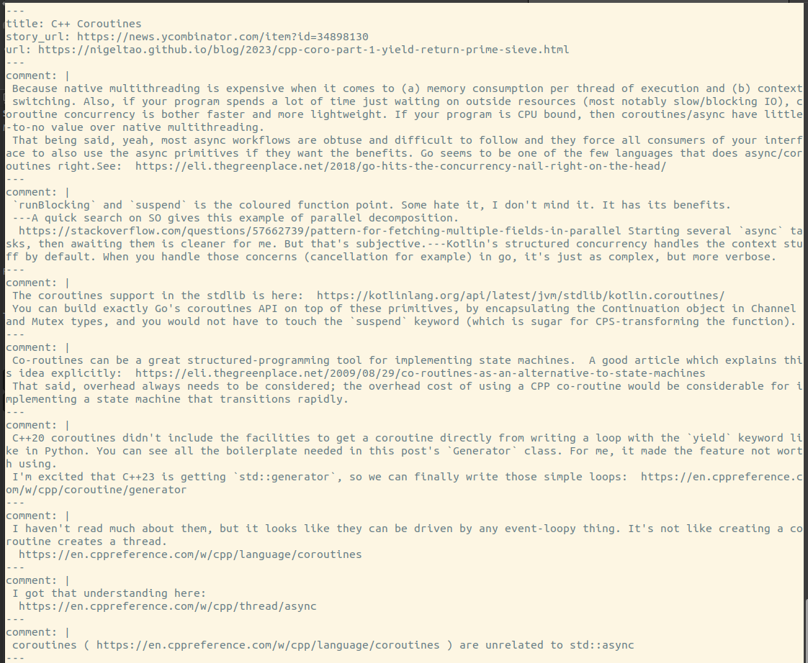
    * Markdown format
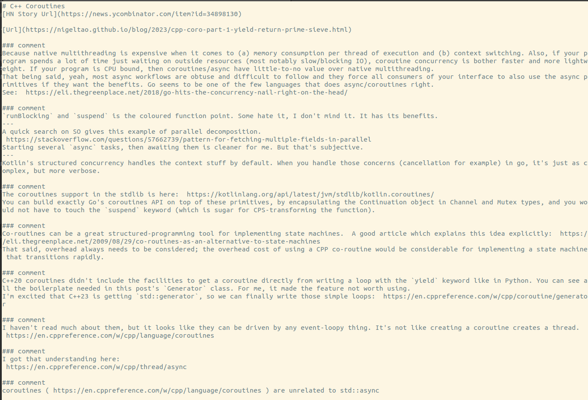

4. Show the clipboard and manage a clipboard per story
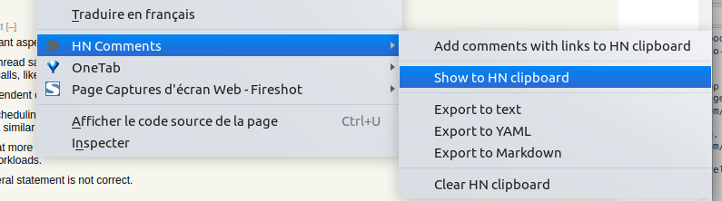
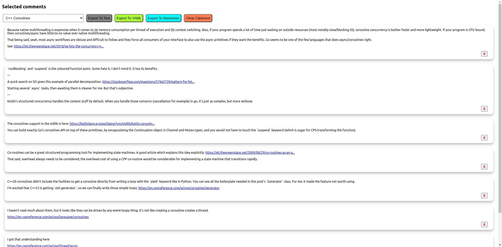

5. Update selection
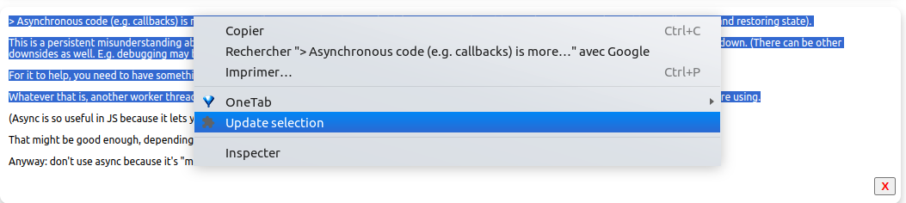
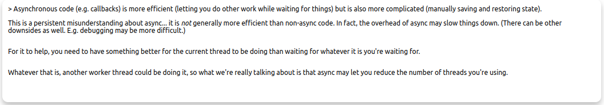

6. Clear the clipboard. When done from the contextual menu clear all the saved comments of all visited stories. The operation in the clipboard page, clear only the active story saved comments.
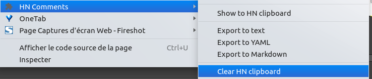
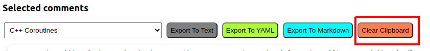
